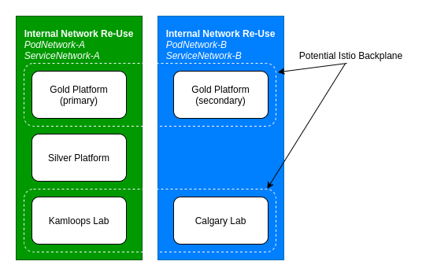

# Cluster Internal Network design

This document contains the information used to decide whether to provision separate (unique) networks for each OpenShift 4 cluster.  The current design requires routeable (public) IP addresses only at the F5 ingress/egress points for each cluster, and we are not looking to change the design of using private (non-internet routable) IP addresses for the rest of the networks.  The decision in question is whether we can re-use the same private network ranges for multiple clusters.  This decision supports a critical cluster component, which if changed, would require a full re-installation of a given cluster.

## Background

With each OpenShift cluster, internal networks are used for in-cluster communications.  These networks are private networks that rely on ingress and egress Network Address Translation.  If a network does not require external direct routing/exposure, then we can save on IP network reservations by re-using these private networks.  The following networks are the potential private networks for OCP 4:

- Host/Node Network - primary physical interface for each physical host in a cluster (outgoing NAT IP address for all pods on a node)
- Storage Network - connecting NAS storage (NetApp) to each of the hosts within a cluster.
- Pod Network - IP addresses assigned to each pod.
- Service Network - IP addresses assigned to services.

## Network usage

### Host/Node Network

Host IP addresses are used to NAT each hosted PODs outgoing traffic, as well as host specific node/cluster related services.  Incoming application traffic will not be directed at a host IP address.  While we are planning to use outgoing NAT on the F5, there are situations where we may want to be able to direct route to these host IP addresses from inside the data-centres.  Current OCP3 leverages public IP addresses for all host/nodes so a pre-build list of services that would require direct access has not been described/tested yet.

A separate, unique, private and routable Host/Node network for each cluster is recommended.

### Storage Network

This network will be leveraged for high speed communication between the NetApp appliance and the cluster Hosts/Nodes.  While no other access is planned for this network, there are still design elements to identify (eg: backup network integration, etc) that may benefit from a unique network assignment.

A separate, unique, private Storage network for each cluster is recommended.  With private routing to be determined by Backup service requirements.

### Cluster Pod and Service Networks

These networks are used by internal pod-pod communication while external cluster access (both incoming and outgoing) is routed through the host/node IP address or a routed ingress IP.  This makes these networks good candidates for re-using network ranges.

A known technology that will be impacted by this decision is the Istio Service Mesh implementation.  The internal pod and service networks are used for service discovery within a Mesh backplane.  One design for a multi-cluster deployment uses a single (shared) Istio backplane.  This design requires uniquely identifiable pod endpoints.  A second design uses separate Istio backplanes for each cluster, and replication between backplanes provides cross-cluster service discovery.  This design would NOT require uniquely identifiable pod endpoints between clusters.

Choosing to re-use the internal cluster networks (for pods and services) will remove the option to stretch an Istio Backplane across multiple clusters.  Requesting additional private networks for each production cluster will require requests for reserved network ranges from hosting services.

The current production architecture defines a *Silver* platform that includes a single cluster, and *Gold* platform that is made up of 2 clusters in separate physical regions.

The recommendation is to leverage unique cluster pod/service networks within each region.  This would allow the option of a single Istio Backplane across the Gold clusters in the future, while not demanding unique pod/service networks in every cluster.  This would allow partial re-use of reserved networks while not blocking a future design pattern we may need to leverage.

Diagram to illustrate use of unique pod/service networks:

