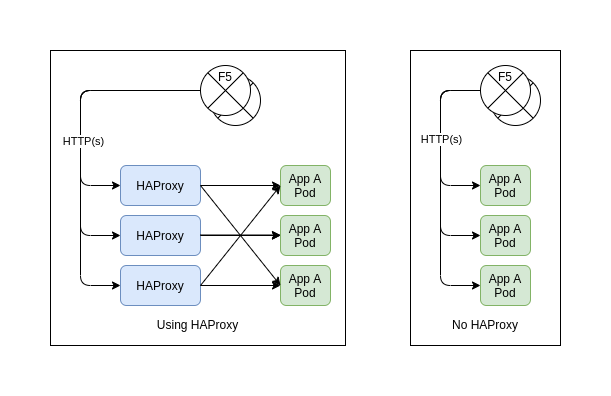

# F5 or HAProxy Decision

This document contains the information used to decide whether to leverage the built-in OpenShift HAProxy router as the default cluster ingress for HTTP(S) or the F5 BigIP Controller operator.

## Background

The F5 BigIP Controller operator was originally identified as the preferred tool to enable non-HTTP ingress to the OCP4 clusters.  The default OpenShift HAProxy routers do not support this type of traffic, and the integration with the F5 controller will enable automation and consistent implementation of these (non-HTTP) ingress types.

The F5 BigIP Controller has additional functionality that would allow us to *replace* the OpenShift HAProxy routers all together.

## Evaluation Criteria

With duplicate functionality between the F5 and the HAProxy routers, the following points were used to compare and ultimately decide on the current path forward.

### Route Features

Both the F5 and the HAProxy routers support the same base Route configurations (Unsecured, Edge, Passthrough, Re-encrypt) and have a comparable feature set for basic router configuration (whitelist, load balance method, etc)

The Features of the F5 router will allow for exposure of more complex load balancing features.  The majority of the current OCP deployed applications do not implement advanced load-balancing or router configuration at this time.

### Performance

Using the F5 as the default ingress route would remove 1 hop from all of the ingress to the platform and improve latency to running applications by a small amount.  The F5 appliances can also provide improved SSL encrypt/decrypt speeds, and offload the SSL processing (edge and re-encrypt) from the OCP Cluster.  Concerns have been identified with the projected amount of core/ram usage of the cluster and the current amount of free capacity in the Hosted F5 solution.  While it is not expected to be a performance bottleneck, it does identify the Hosted F5 service capacity as a critical external dependency.

The OpenShift HAProxy routers can run on any existing OCP hardware, and can be scaled up to handle increases in capacity demand.  The current OCP implementation leverages this approach successfully.

### Vendor Support

We have excellent support from both F5 and RedHat, and the F5 router integration is fully supported by both RedHat and F5.

## Recommendation

Continue to leverage the OpenShift HAProxy router for default (HTTP(S)) ingress to the cluster, while integrating non-HTTP ingress using the F5 Controller operator.  Acknowledging that this recommendation can be modified in the future.

With external dependency on an integration feature we have not verified under load conditions, leveraging the known approach for the default ingress gives us the following immediate benefits:

- Known ingress design reduces operational change between existing and new clusters.
- Known ingress design reduces development team training requirements for Migration tasks.
- Removes external capacity dependency.

The F5 integration will continue to be developed for non-HTTP ingress.  As that implementation matures on the platform we can continue to evaluate the default cluster ingress options.