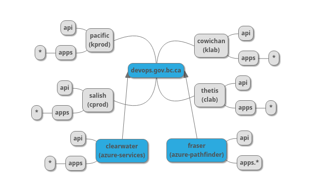

# DNS design for multi-cluster deployments

All production applications hosted on the platform are expected to also maintain a specific vanity domain for public routes (all out of cluster access).  Individual Cluster DNS can be used for dev/test functions during the initial development of an application.  Once an application is ready to deploy to production, an application specific vanity domain will be created/used by the development team(s) and attached to the appropriate ingress route.  

An example vanity domain is developer.gov.bc.ca.  This domain will be used for published platform service applications (eg: chat.developer.gov.bc.ca, sso.developer.gov.bc.ca, etc) while internal development can use the specific cluster wildcard DNS.

## Individual Cluster DNS

Each individual cluster will have it's own domain within the devops.gov.bc.ca base domain.

Base Domain: devops.gov.bc.ca

- cluster_name: pacific (kprod) | salish (cprod) | cowichan (klab) | thetis (clab) | clearwater (Azure services) | fraser (New pathfinder)
- Cluster ID: <cluster_name>.devops.gov.bc.ca
- Cluster API: api.<cluster_name>.devops.gov.bc.ca
- App wildcard: *.apps.<cluster_name>.devops.gov.bc.ca

example test application URL: helloworld.apps.<cluster_name>.devops.gov.bc.ca

### Naming for On-Prem clusters

The <base_domain>s for the on-prem clusters will be devops.gov.bc.ca, and each cluster will have it's own dedicated sub-domain.  The primary production cluster will be the Kamloops hosted *pacific.devops.gov.bc.ca*, and the production DR site will be the calgary hosted *salish.devops.gov.bc.ca.  These clusters will host tenant (developer) built applications as well as any local platform services such as cluster registries, local artifact stores, etc.

The production clusters will be mirrored with 2 smaller (virtual) lab clusters to allow platform validation for operational activities such as patching, platform tool upgrades, configuration changes, etc.  The primary lab cluster will be the Kamloops hosted *cowichan.devops.gov.bc.ca*, and the DR lab cluster will be the calgary hosted *thetis.devops.gov.bc.ca*.

### Naming for Azure clusters

The <base_domain>s for the azure clusters will be devops.gov.bc.ca, and each cluster subdomain will be delegated to the azure DNS service.

#### Platform Services Cluster

This cluster is targeted to host the platform services that provide support services for the platform.  Rocket.chat communication tool, Documize for centralized platform documentation and communication, the DevHub (https://developer.gov.bc.ca) are some examples of platform tools that may be hosted outside of the primary platform.

- Cluster ID: clearwater.devops.gov.bc.ca
- Cluster API: api.clearwater.devops.gov.bc.ca
- App wildcard: *.apps.clearwater.devops.gov.bc.ca
- Additional wildcard: *.developer.gov.bc.ca

example: chat.developer.gov.bc.ca

#### Pathfinder Cluster

This will become the new pathfinder cluster to explore new technologies.  This cluster will be the target for exploring uses for new technologies.

- Cluster ID: fraser.devops.gov.bc.ca
- Cluster API: api.fraser.devops.gov.bc.ca
- App wildcard: *.apps.fraser.devops.gov.bc.ca
- Additional wildcard: *.pathfinder.devops.gov.bc.ca

example: coolapp.pathfinder.devops.gov.bc.ca

## BigIP DNS

Each public DNS for an application can be assigned an external IP address (a BigIP) at the GTM layer.  This will load balance between LTM pools for each application.  Currently this will load-balance with an active/passive (Kamloops/Calgary) approach that will only direct traffic to the Calgary cluster when the Kamloops service is unavailable.  The BigIP DNS will also be the primary target for all other multi-cluster application deployments as well.  (load balancing between an on-prem cluster an an Azure hosted cluster for example.)