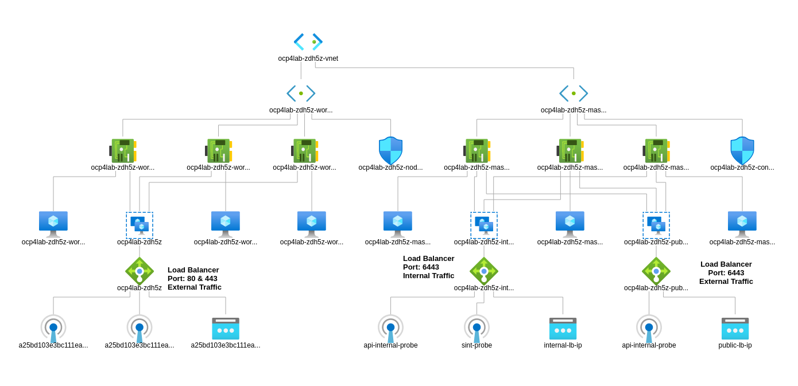
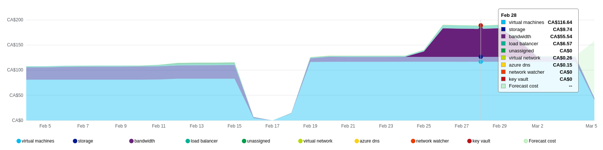
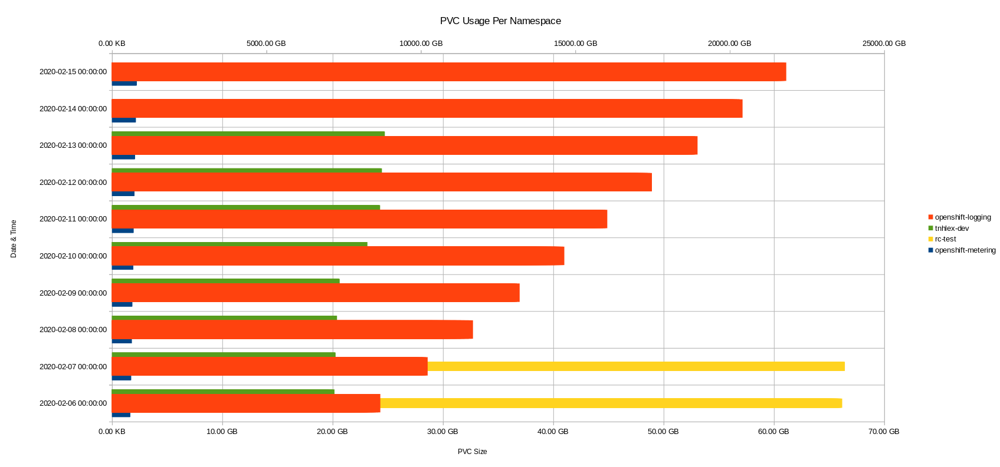

# OpenShift 4 on Azure Readme

- [OpenShift 4 on Azure Readme](#openshift-4-on-azure-readme)
  - [Purpose](#purpose)
  - [Region](#region)
  - [Azure SP Account](#azure-sp-account)
  - [Resource Groups](#resource-groups)
  - [Node Details](#node-details)
    - [Infrastructure nodes](#infrastructure-nodes)
    - [Node Sizing](#node-sizing)
    - [Node Storage](#node-storage)
  - [Subscription Info](#subscription-info)
    - [Subscription Count](#subscription-count)
  - [Networking](#networking)
    - [DNS](#dns)
    - [SSL Certificates](#ssl-certificates)
  - [Cluster PV Storage](#cluster-pv-storage)
    - [Azure File](#azure-file)
    - [Resources](#resources)
  - [Logging Stack](#logging-stack)
    - [Compute & Memory](#compute--memory)
    - [Storage](#storage)
    - [Resources](#resources-1)
  - [Authentication](#authentication)
  - [Costing](#costing)
  - [Metering](#metering)
    - [Resources](#resources-2)


## Purpose

This document is intended to outline the design of the OpenShift Container Platform v4 on Azure. This is the first generation of OpenShift in a cloud platform at BC Gov, as the cluster is deployed and applications loaded on architecture decisions may be updated and changed.

## Region

If deploying to Canada Central or Canada East Azure regions there are no availability zone options. If a diaster occurred at one of these datacenters the OpenShift cluster would suffer an outage. Opposed to an Azure region that had multiple zones or locations. An option may be to sand up an OCP 4 cluster in Azure Canada Central and Canada East providing multi region availability. 

The first iteration will be deployed to Canada Central.

## Azure SP Account

Because OpenShift Container Platform and its installation program must create Microsoft Azure resources, we must create a service principal to represent it.

The SP account will need to be created in the Azure AD associated to the subscription where OCP 4 will be installed. You will need the Tenant Administrator role in Azure AD to create the SP account. Details on creating this account are listed in the [OpenShift Documentation](https://docs.openshift.com/container-platform/4.2/installing/installing_azure/installing-azure-account.html#installation-azure-service-principal_installing-azure-account)

## Resource Groups

The current version of OpenShift 4 makes use of an installer provisioned infrastructure where the OpenShift installer will create the required infrastructure in Azure and then install OpenShift on to this infrastructure. Due to this installation method some installation options are not configurable. One of these is the Azure Resource group where all the Azure objects are contained. The Azure RG will be dynamically created with a name based off the name of the cluster e.g.; `ocp4lab-9qtf7-rg`.

This option may change in later version but as of 4.2 & 4.3 we can not pre-create the RG.

## Node Details

The install will start with 3 Master nodes and 3 worker nodes. This can be grown dynamically by updating machine-set replica numbers inside the cluster. 3 Infrastructure nodes will be deployed after the cluster is up and Infrastructure cluster components moved to these nodes. This will leave us 3-3-3 initial node set up.

With the cluster running in Azure and leveraging cloud features growing the worker nodes is a simple as updating replica numbers and waiting for Azure to provision the node. The dynamic nature allows scaling back worker nodes if no longer needed also.

### Infrastructure nodes

Infrastructure nodes are not counted toward the total number of subscriptions that are required to run the environment. The following OpenShift Container Platform components are infrastructure components:

* Kubernetes and OpenShift Container Platform control plane services that run on masters
* The default router
* The container image registry
* The cluster metrics collection, or monitoring service
* Cluster aggregated logging
* Service brokers

Any node that runs any other container, pod, or component is a worker node that your subscription must cover.

### Node Sizing

The Azure `Standard_D8s_v3` machine type will be used for all six nodes.


| Size | vCPU | Memory: GiB | Temp storage (SSD) GiB | Max data disks | Max cached and temp storage throughput: IOPS / MBps (cache size in GiB) | Max uncached disk throughput: IOPS / MBps | Max NICs / Expected network bandwidth (Mbps) |
|-----------------|------|-------------|------------------------|----------------|-------------------------------------------------------------------------|-------------------------------------------|----------------------------------------------|
| **Standard_D8s_v3** | 8 | 32 | 64 | 16 | 16000 / 128 (200) | 12800 / 192 | 4 / 4000 |
|  |  |  |  |  |  | |  |
| **Count/Totals:**   9 VMs | 72 | 288 |  | 9 x 128GB SSD Disk = 1.15TB  |  |  |

### Node Storage

The nodes will receive 1 OS disks with 128GB of storage. This is around the recommended minimum disk sizes. A better disk and partition scheme will be determined at a later date so we are not relying on a single disk.

## Subscription Info

We will need a pull secret to give to the Openshift 4 installer. The pull secret can be obtained here: https://cloud.redhat.com/openshift/install/pull-secret after logging in with a Red Hat account.

When the cluster first comes up it will default to a 60 day evaluation. This will be fine as we plan to destroy and re-create. Once the cluster is up is a steady permanent state we will need to assign subscriptions to it via Red Hat portal. 

### Subscription Count

The worker nodes will be the only nodes needing an Red Hat OpenShift Subscription. Based on numbers above we will need `12` OpenShift subs to start with.

## Networking

The default networking options will be selected to start with, which can be changed at a later date.

```
networking:
  clusterNetwork:
  - cidr: 10.128.0.0/14
    hostPrefix: 23
  machineCIDR: 10.0.0.0/16
  networkType: OpenShiftSDN
  serviceNetwork:
  - 172.30.0.0/16
  ```

The Openshift 4 installer takes care of deploying and configuring required load balancers and setting up firewall rules. The network after deployment looks like the following:



We will be using the [private cluster](https://docs.openshift.com/container-platform/4.3/installing/installing_azure/installing-azure-private.html) method on Azure so load balancers will get private addresses. Public access will come in through on-prem Gov load balancers that map back to the Azure lbs. 

We will also deploy to an existing vnet in Azure that the gov has set up. We configure this in the `install-config.yaml`. A vnet won't be created and the VMs will get IPs from the existing subnets. We need 2 subnets, 1 for the workers and 1 for the masters.

### DNS

The subdomain `clearwater.devops.gov.bc.ca` has been selected for the time being which may be updated at a later date. This DNS zone is created in Azure so the cluster can dynamically create zone records.

The subdomain `clearwater.devops.gov.bc.ca` will need to be delegated to Azure NS records.

```
ns1-07.azure-dns.com.
ns2-07.azure-dns.net.
ns3-07.azure-dns.org.
ns4-07.azure-dns.info.
```

### SSL Certificates

Default self signed certificates are in place after a fresh cluster install. Two SSL certificates for specific DNS names will be needed.

* api.ocp4lab.clearwater.devops.gov.bc.ca
* *apps.ocp4lab.clearwater.devops.gov.bc.ca


## Cluster PV Storage

We will be able to leverage Azure file and block options for PV usage in the cluster. We can also create PVs based on Azure disk performance/pricing options.

A more detailed PV design will be determined at a later date. Azure Netapp Files is an option that can be looked at as well.

### Azure File

We create a storage account in Azure and specify this in the azure-file storage class so file storage can be dynamically created.

* Account Kind: StorageV2
* Performance: Standard 
* Replication: GRS
* Network: Public Endpoint (select the created ocp4 vnet & 2 subnets)
Note: This creates a publicly accessible storage service endpoints but locks down what networks can access it.
* Secure Transfer: Enabled

If we want to lock down the storage account to just the file service we can select Premium as the performance option. The issue is when using Premium the smallest size of the PV which relates to storage account quota is 100GB. Premium is priced on provisioned storage where standard is priced on used storage. Premium IO and network bandwidth limits scale with the provisioned share size.

In our azure-file storage class we set a value for secretNamespace parameter, as this is the namespace that stores the storage account keys in a secret. If not set the storage account credentials may be read by other users.

### Resources

* Pricing: https://azure.microsoft.com/en-us/pricing/details/storage/files/
* Storage Network Security: https://docs.microsoft.com/en-us/azure/storage/common/storage-network-security
* K8s azure-file SC info: https://kubernetes.io/docs/concepts/storage/storage-classes/#azure-file
* OCP manual Azure File: https://docs.openshift.com/container-platform/4.2/storage/persistent-storage/persistent-storage-azure-file.html
* OCP dynamic Azure File: https://docs.openshift.com/container-platform/4.2/storage/dynamic-provisioning.html#azure-file-definition_dynamic-provisioning
* Microsoft Docs K8s Azure File: https://docs.microsoft.com/en-us/azure/aks/azure-files-dynamic-pv

## Logging Stack

The OpenShift cluster logging components are based upon Elasticsearch, Fluentd, and Kibana will be deployed into the cluster. This will allow for a longer retention of pod logs.

A logging Curator will run every night a midnight. This will clear out logs older than 30 days which is the default. This can be highly customized about what project keeps how many logs. This will need to be reviewed as cluster application deployment goes up.

### Compute & Memory 

Elasticsearch has the biggest resource consumption for the logging stack. `16Gi` memory is the recommended minimum memory size per ES pod. `3` ES replica pods will be configured as well so there is a ES pod per infrastructure node. `2` CPU limits\requests per pod is also defined. Totals for Elasticsearch are `48GB` of ram and `6` CPU cores. 

Kibana resources defaults are minimal. Fluentd needs a pod per node in the cluster to collect logs. Default memory request/limit is `736Mi` which means a total of `6.6GB` memory for the initial node deployment. CPU resources for Fluentd are minimal.

### Storage

Elasticsearch needs to store the indexes for the log data it receives. It also needs to be available in case nodes go dow for maintenance. Will set `SingleRedundancy` for the redundancy policy which Elasticsearch makes one copy of the primary shards for each index. Logs are always available and recoverable as long as at least two data nodes exist. We will start with `200G` PVC for each of the ES pods. Totally `600GB` of Persistent Storage

### Resources

* https://docs.openshift.com/container-platform/4.2/logging/cluster-logging.html

## Authentication 

The cluster will be set up to use GitHub Organizations as the identity provider.

Documentation here: https://docs.openshift.com/container-platform/4.2/authentication/identity_providers/configuring-github-identity-provider.html


## Costing

This graph shows a snapshot of the running costs for OCP 4 cluster on Azure by day. The early Feb dates are the cluster mainly idling. The gap in the middle is the cluster being destroyed then created a few days later. The rise at the end of Feb are load tests being run against the cluster.



Estimate would be daily costs around $200 a day on an active cluster.

## Metering

The OpenShift metering stack will be deployed into the cluster. This will allow for users of metering to do reporting on pods, namespaces, and most other Kubernetes resources by querying Prometheus data.

Metering is managed using the following CustomResourceDefinitions (CRDs):

* **MeteringConfig:** Configures the metering stack for deployment. Contains customizations and configuration options to control each component that makes up the metering stack.
* **Reports:** Controls what query to use, when, and how often the query should be run, and where to store the results.
* **ReportQueries:** Contains the SQL queries used to perform analysis on the data contained within ReportDataSources.
* **ReportDataSources:** Controls the data available to ReportQueries and Reports. Allows configuring access to different databases for use within metering.

Metering is an operator installed via the operator hub. Metering resources on cluster are minimal and require `4-5GB` of Memory for the pods and an initial `5GB` PVC.

After reports are created they are available in CSV format via the web UI under Administration->Chargeback or via the metering route. CSV data can be set up to display in useful charts.



### Resources

* https://itnext.io/operator-metering-with-look-back-kubernetes-reports-85d6b86b1e3c
* https://github.com/operator-framework/operator-metering
* https://docs.openshift.com/container-platform/4.2/metering/metering-about-metering.html